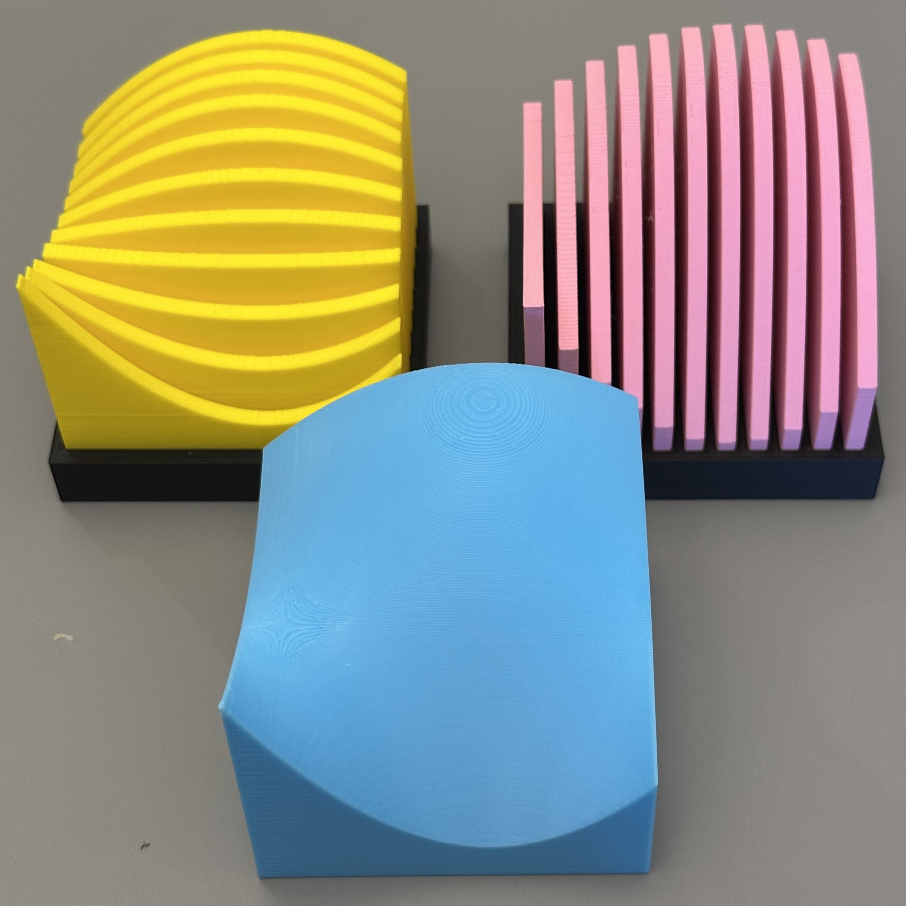
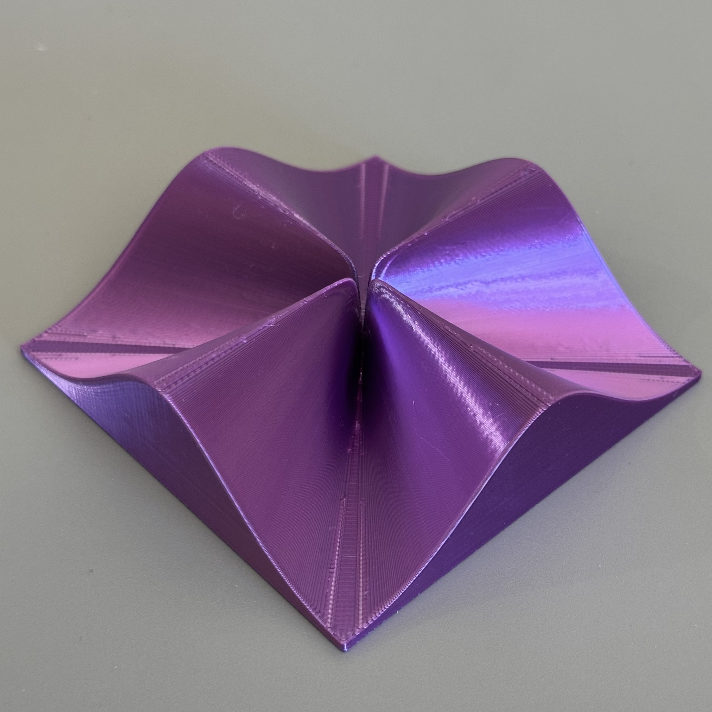
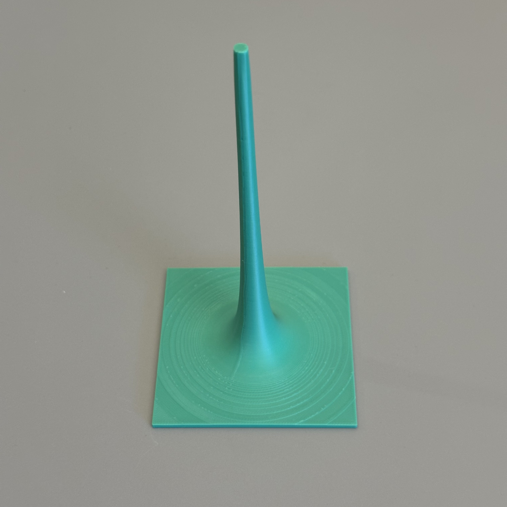

# Calculus 3D Models: Riemann Sum Approximations for Double Integrals

This repository contains OpenSCAD models for multivariable calculus surfaces and Riemann-sum-style visualizations of functions of two variables. It includes multiple `.scad` entry files, a shared surface engine, and several pre-generated `.stl` examples.

## Mathematical Description

- For Riemann-sum outputs, the model approximates the volume under a surface \( z = f(x, y) \) over a rectangular domain.
- The surface can be approximated by rectangular prisms ("Riemann sum boxes").
- Each prism height is determined by sampling the function \( f(x, y) \) at each sub-rectangle.

## Riemann Sum Examples

  
  

## Slice + Full Surface Example

`slices_example.jpeg` shows three printed models: x-slices in the holder, y-slices in the holder, and the complete surface.

  

## No-Limit Example

`no_limit_1.jpeg` shows the surface for the `no_limit_1.scad` function.

  

## Infinite-Limit Example

`infinite_limit.jpeg` shows the surface for the `infinite_limit.scad` function.

  

## Interactive Previews

- [Monkey saddle model](MonkeySaddle.stl) (preview STL file)
- [Sombrero function model](Sombrero.stl) (preview STL file)
- [No-limit (example 1)](no_limit_1.stl) (preview STL file)
- [No-limit (example 2)](no_limit_2.stl) (preview STL file)
- [Infinite-limit capped surface](infinite_limit.stl) (preview STL file)
- [Local max example](LocalMax.stl) (preview STL file)
- [X-slices example](LocalMaxXSlices.stl) (preview STL file)
- [Y-slices example](LocalMaxYSlices.stl) (preview STL file)
- [Holder example](holder.stl) (preview STL file)
- [Y-slices print example](y_slices.stl) (preview STL file)

## How to Use

- Open one of the function files in [OpenSCAD](https://openscad.org/), for example:
  - `monkey_saddle.scad`
  - `sombrero.scad`
  - `infinite_limit.scad`
  - `no_limit_1.scad`
  - `no_limit_2.scad`
  - `not_differentiable.scad`
  - `LocalMax.scad`
  - `CosCos.scad`
  - `GaussianCos.scad`
  - `QuarticPolynomial.scad`
- Customize parameters:
  - In the selected main function file: `xmin`, `xmax`, `ymin`, `ymax`, `nx`, `ny`, `targetxwidth`, `verticalscalefactor`, `verticaltranslation`, and `k`.
  - The function definition `f(x, y)` is also in that same file.
  - `nx`, `ny`: Number of subdivisions in the \( x \) and \( y \) directions.
  - `targetxwidth`: Set the final width of the printed model (in millimeters); other dimensions scale proportionally.
- `MathSurface3d.scad` is the shared engine file included by each function file.
- Render the model.
- Export the model to STL for 3D printing or visualization.

Most files also support multiple output modes such as full surface, Riemann sum boxes, x/y slices, and holder-compatible outputs.

## Files Included

- `MathSurface3d.scad` — Shared surface engine used by the function files.
- Function entry files:
  - `CosCos.scad`
  - `GaussianCos.scad`
  - `infinite_limit.scad`
  - `LocalMax.scad`
  - `monkey_saddle.scad`
  - `no_limit_1.scad`
  - `no_limit_2.scad`
  - `not_differentiable.scad`
  - `QuarticPolynomial.scad`
  - `sombrero.scad`
- Example assets:
  - Images: `MonkeySaddle.jpeg`, `SombreroFunction.jpeg`, `slices_example.jpeg`, `no_limit_1.jpeg`, `infinite_limit.jpeg`
  - STLs: `MonkeySaddle.stl`, `Sombrero.stl`, `infinite_limit.stl`, `no_limit_1.stl`, `no_limit_2.stl`, `LocalMax.stl`, `LocalMaxXSlices.stl`, `LocalMaxYSlices.stl`, `holder.stl`, `y_slices.stl`

## License

This project is licensed under the [Creative Commons Attribution-NonCommercial 4.0 International License](https://creativecommons.org/licenses/by-nc/4.0/).  
Feel free to use, modify, and share for educational or personal use, with attribution. Commercial use is not permitted.
